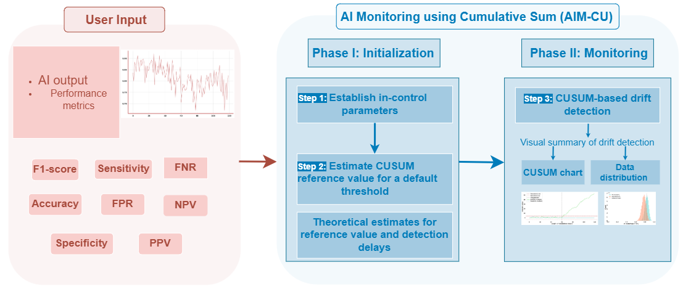

AIM-CU: A CUSUM-based tool for AI Monitoring
======

Monitoring a clinically deployed AI device to detect performance drift is an essential step to ensure the safety and effectiveness of AI. 

AIM-CU is a statistical tool for AI monitoring based on a cumulative sum (AIM-CU) approach.

AIM-CU computes:

* The parameter choices for change-point detection based on an acceptable false alarm rate
* Detection delay estimates for a given displacement of the performance metric from the target for those parameter choices.

System setup
------------
Make sure R is installed in the system. There is no specific version that this relies on. Here we have used the version 4.1.2 (2021-11-01). 
Instructions for Linux (the below setup is only performed in Linux):

.. code-block:: shell

    wget -qO- https://cloud.r-project.org/bin/linux/ubuntu/marutter_pubkey.asc |  tee -a /etc/apt/trusted.gpg.d/cran_ubuntu_key.asc
    add-apt-repository "deb https://cloud.r-project.org/bin/linux/ubuntu $(lsb_release -cs)-cran40/"
    apt-get install -y --no-install-recommends r-base r-base-dev

    # setup R configs
    echo "r <- getOption('repos'); r['CRAN'] <- 'http://cran.us.r-project.org'; options(repos = r);" > ~/.Rprofile
    Rscript -e "install.packages('ggplot2')"
    Rscript -e "install.packages('hexbin')"
    Rscript -e "install.packages('lazyeval')"
    Rscript -e "install.packages('cusumcharter')"
    Rscript -e "install.packages('RcppCNPy')"
    Rscript -e "install.packages('spc')"

Code execution
--------------
Clone AIM-CU repository.

.. code-block:: shell

    git clone https://github.com/DIDSR/AIM-CU.git

Run the following commands to install required dependencies (Python = 3.10 is used).

.. code-block:: shell

    apt-get -y install python3
    apt-get -y install pip
    cd AIM-CU
    pip install -r requirements.txt

Run AIM-CU.

.. code-block:: shell

    cd src/package
    python3 app.py

Open the URL http://0.0.0.0:7860 that is running the AIM-CU locally.

Example code execution
----------------------
Example code can be run through Jupyter Notebook. Do this by entering the ``jupyter notebook`` command from the ``/src/package/`` directory. The tool is designed to be used through a GUI, not from the console.

Demo
----
AIM-CU can also be run through the demo available at https://huggingface.co/spaces/didsr/AIM-CU. If Space is paused, click on Restart button. Note: this Space uses a custom Docker container; build may break due to latest package updates pulled by HuggingFace.

Usability
---------
* Example AI output CSV file is available as `config/spec-60-60.csv <config/spec-60-60.csv>`_ to be uploaded in monitoring phase.

* Workflow instruction to run the tool is available at bottom-left of UI.

* Sample UI output is available at `assets/ui.png <assets/ui.png>`_.

* Setting ``control:save_figure`` to ``true`` from `config.toml <config/config.toml>`_ will save tables and plots in `figure/ <figure/>`_.

* Running AIM-CU usually only takes a few seconds, and it does not require a GPU to run.

Related References
------------------
1. Prathapan, S., Samala, R., Hadjiyski, N. et al. Detecting Performance Drift in AI Models for Medical Image Analysis Using CUSUM Chart. J Digit Imaging. Inform. med. (2026). https://doi.org/10.1007/s10278-026-02113-9

2. Prathapan, S., Samala, R.K., Hadjiyski, N., D’Haese, P.F., Maldonado, F., Nguyen, P., Yesha, Y. and Sahiner, B., 2024, April. Quantifying input data drift in medical machine learning models by detecting change-points in time-series data. In Medical Imaging 2024: Computer-Aided Diagnosis (Vol. 12927, pp. 67-76). SPIE. https://doi.org/10.1117/12.3008771

Disclaimer
---------------------

**About the Catalog of Regulatory Science Tools**

The enclosed tool is *in preparation* for the `Catalog of Regulatory Science Tools <https://cdrh-rst.fda.gov>`_. Note that this software is not (yet) a standalone RST but rather is to be included as a **reference tool** to support other Regulatory Science Tools (such as synthetic datasets) for reproducibility.

This catalog collates a variety of regulatory science tools that the FDA's Center for Devices and Radiological Health's (CDRH) Office of Science and Engineering Labs (OSEL) developed. These tools use the most innovative science to support medical device development and patient access to safe and effective medical devices. If you are considering using a tool from this catalog in your marketing submissions, note that these tools have not been qualified as `Medical Device Development Tools <https://www.fda.gov/medical-devices/medical-device-development-tools-mddt>`_ and the FDA has not evaluated the suitability of these tools within any specific context of use. You may `request feedback or meetings for medical device submissions <https://www.fda.gov/regulatory-information/search-fda-guidance-documents/requests-feedback-and-meetings-medical-device-submissions-q-submission-program>`_ as part of the Q-Submission Program.

For more information about the Catalog of Regulatory Science Tools, email RST_CDRH@fda.hhs.gov.
